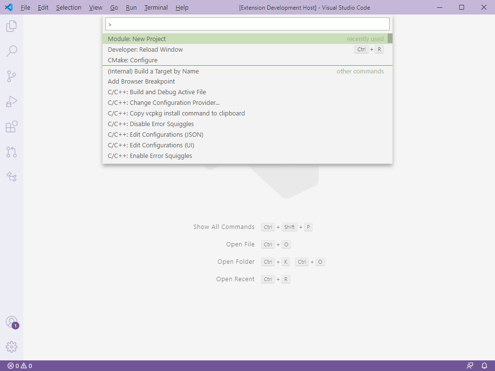
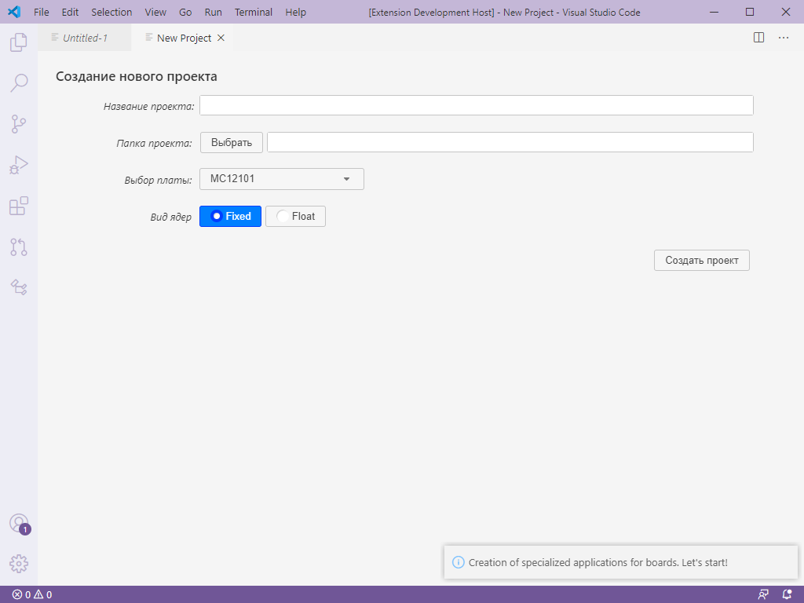
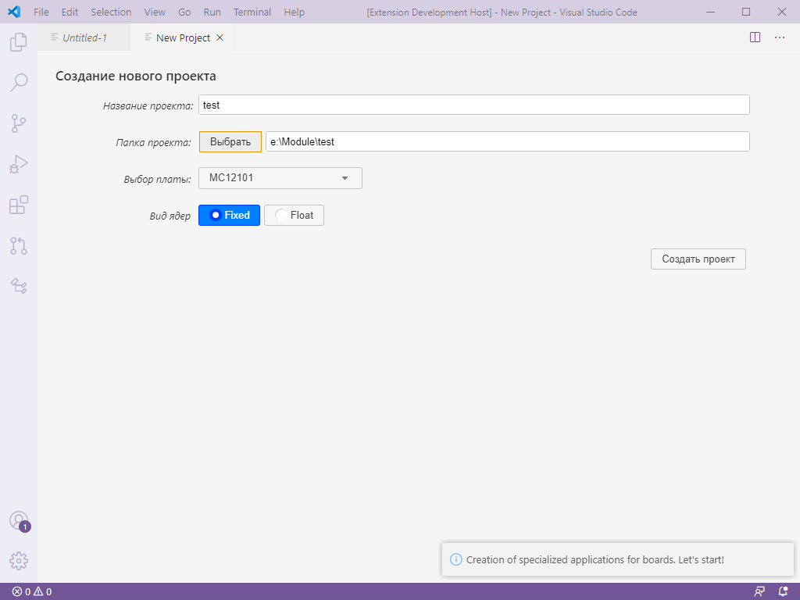
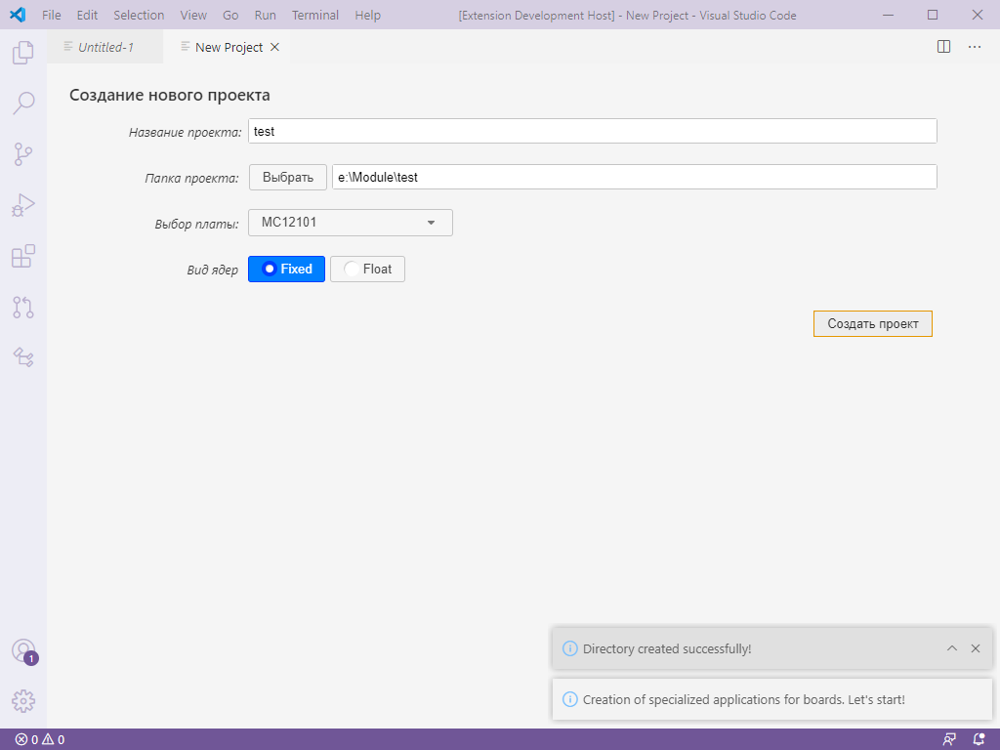
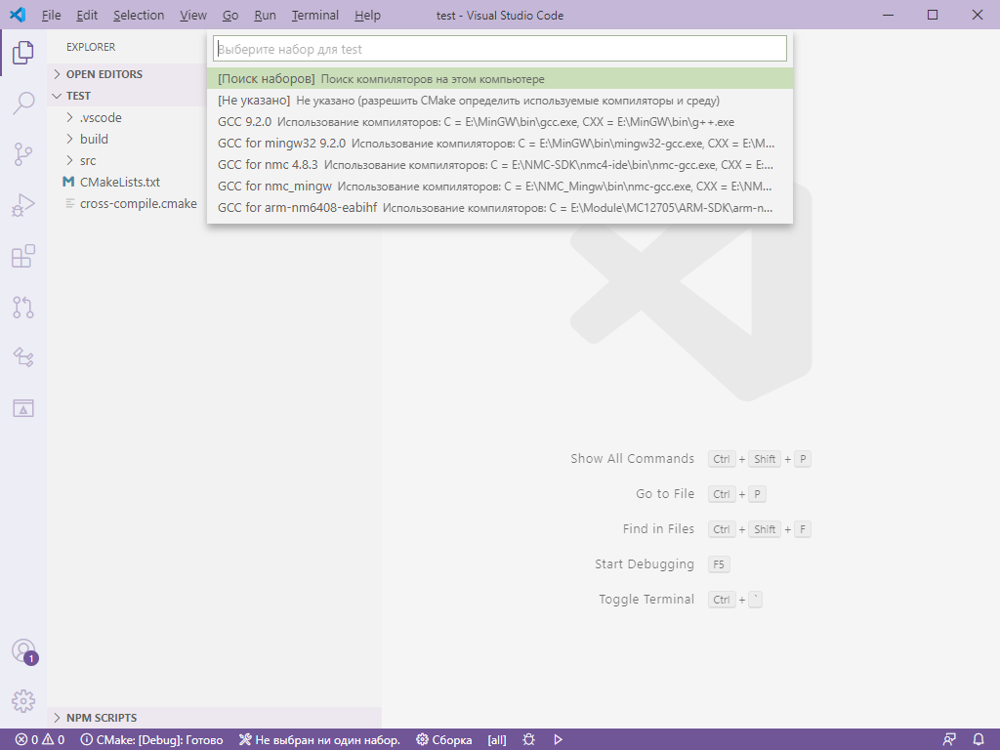
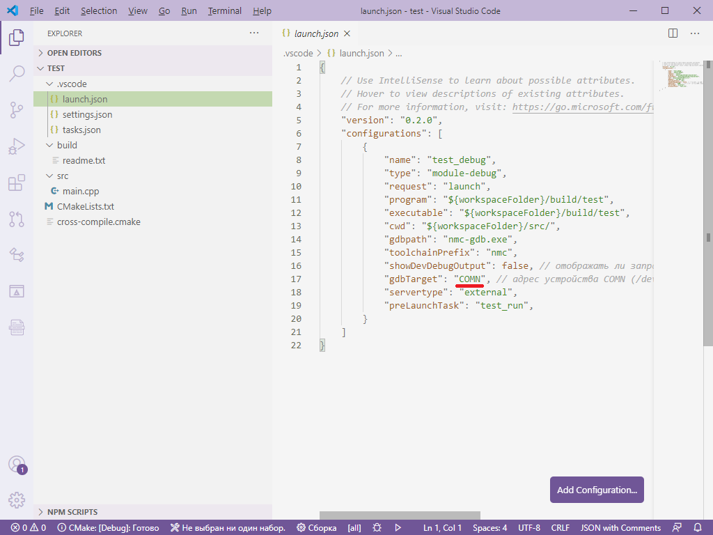

## Extension commands

* `extension.StartApp` calld by `Module: New Project"` - it's to create the necessary folders and files for selected board by template project

### 0.1.0

Реализовано создание проекта для плыта MC121.01 для ядер fixed или float.

Работа с расширением начинается с вызова окна создания проекта Ctrl+Shift+P -> "Module: New Project"  

После появления окна создания проекта введите необходимые параметры 

Далее необходимо нажать кнопку "Создать проект". 

Созданный проект откроется в новом окне VS Code и попросит выбрать набор компиляторов:   

Обратите внимание, что в созданном проекте, необходимо будет открыть файл ./.vscode/lounch.json и указать номер COM порта, соответствующий подключенной плате: 

-----------------------------------------------------------------------------------------------------------

**Enjoy!**
